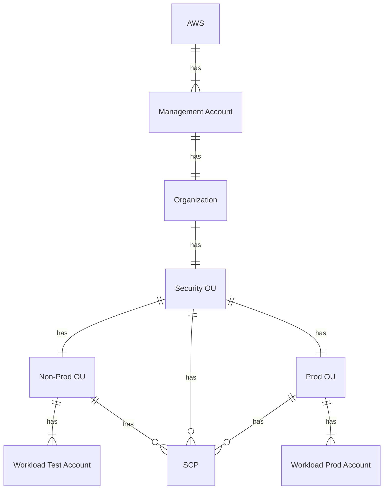

# Workload Organization - AWS

```mermaid
erDiagram
    aws["AWS"]
    mgmt-account["Management Account"]
    organization["Organization"]
    security-ou["Security OU"]
    non-prod-ou["Non-Prod OU"]
    prod-ou["Prod OU"]
    workload-test-account["Workload Test Account"]
    workload-prod-account["Workload Prod Account"]
    scp["SCP"]

    aws ||--|{ mgmt-account: has
    mgmt-account ||--|| organization: has
    organization ||--|| security-ou: has
    security-ou ||--|| non-prod-ou: has
    security-ou ||--|| prod-ou: has
    non-prod-ou ||--|{ workload-test-account: has
    prod-ou ||--|{ workload-prod-account: has
    non-prod-ou ||--o{ scp: has
    security-ou ||--o{ scp: has
    prod-ou ||--o{ scp: has
```
