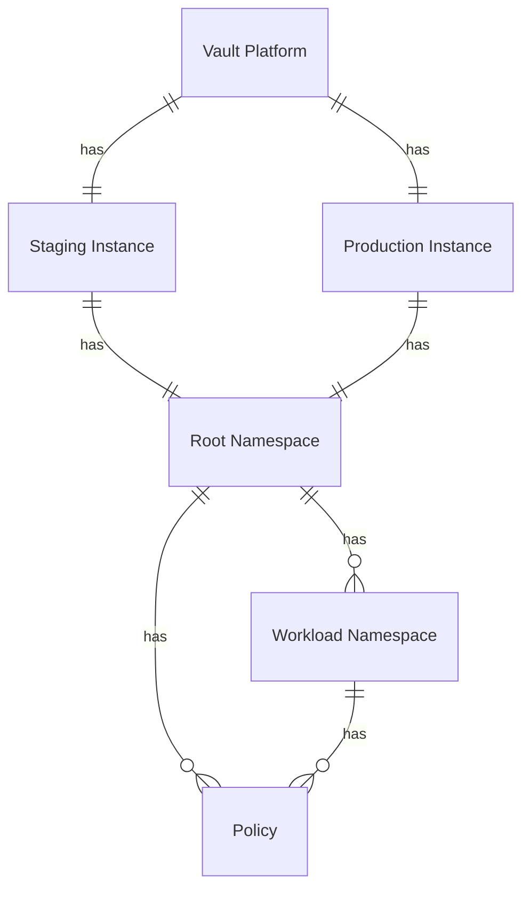

# Workload Organization - Vault

```mermaid
erDiagram
    vault["Vault Platform"]
    stg-instance["Staging Instance"]
    prod-instance["Production Instance"]
    root-namespace["Root Namespace"]
    workload-namespace["Workload Namespace"]
    policy["Policy"]

    vault ||--|| stg-instance: has
    vault ||--|| prod-instance: has
    stg-instance ||--|| root-namespace: has
    prod-instance ||--|| root-namespace: has
    root-namespace ||--o{ workload-namespace: has
    root-namespace ||--o{ policy: has
    workload-namespace ||--o{ policy: has
```
